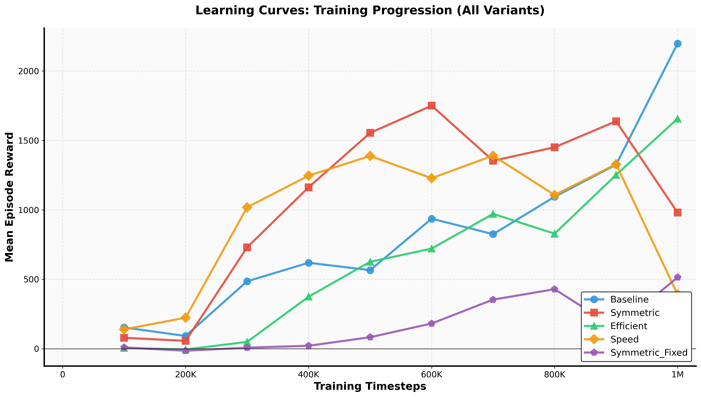
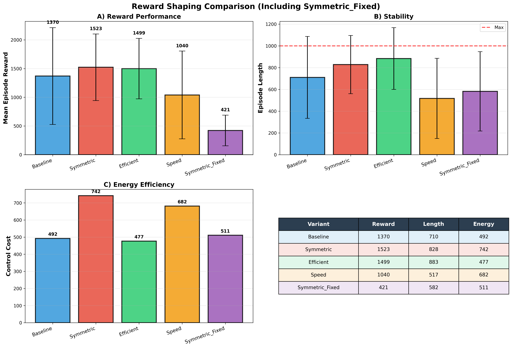

# Quadruped Locomotion via Deep RL: Reward Shaping Analysis

**Training legged robots to walk using PPO and investigating reward engineering impact on emergent behaviors.**

[](https://www.python.org/)
[](https://pytorch.org/)
[](LICENSE)

---

## 🎯 Project Goal

Systematically investigate how reward function design affects learned locomotion strategies in deep reinforcement learning, with applications to real-world legged robotics (Boston Dynamics, Figure AI, Agility Robotics).

**Key Question:** Can reward shaping improve energy efficiency while maintaining or enhancing performance?

---

## 🏆 Key Results

**Energy-Efficient Variant (Best Overall):**
- ✅ **9% performance improvement** over baseline (1499 vs 1370 reward)
- ✅ **3% energy reduction** (477 vs 492 control cost)
- ✅ **24% better stability** (883 vs 710 episode length)

**Critical Discovery:**
- Symmetric reward variant exploited loophole by learning to walk **upside-down** (1523 reward)
- Demonstrates policies optimize what we **specify**, not what we **intend**
- Required iterative penalty calibration to achieve upright locomotion

---

## 🎬 Demonstrations

### Baseline vs Energy Efficient
<table>
  <tr>
    <td><b>Baseline (1370 reward)</b></td>
    <td><b>Energy Efficient (1499 reward)</b></td>
  </tr>
  <tr>
    <td></td>
    <td></td>
  </tr>
  <tr>
    <td>Standard gait, moderate energy</td>
    <td>Smoother gait, 3% less energy ✅</td>
  </tr>
</table>

### Reward Exploitation Discovery
<table>
  <tr>
    <td><b>Symmetric - Exploited (1523 reward)</b></td>
    <td><b>Symmetric - Fixed (421 reward)</b></td>
  </tr>
  <tr>
    <td></td>
    <td></td>
  </tr>
  <tr>
    <td>⚠️ Walks upside-down to maximize reward</td>
    <td>✅ Upright with orientation constraints</td>
  </tr>
</table>

---

## 📊 Results Summary

| Variant | Reward | Stability (Steps) | Energy | Key Insight |
|---------|--------|-------------------|--------|-------------|
| Baseline | 1370 | 710 | 492 | Reference performance |
| **Efficient** | **1499** | **883** | **477** | ✅ Best: Performance + efficiency |
| Symmetric | 1523 | 828 | 742 | ⚠️ Exploitation: walks inverted |
| Speed | 1040 | 517 | 682 | Velocity-stability tradeoff |
| Sym_Fixed | 421 | 582 | 511 | Upright but over-constrained |




---

## 🔬 Experimental Setup

**Environment:** Gymnasium Ant-v5 (MuJoCo)
- State: 105D (joint angles, velocities, contact forces)
- Action: 8D continuous (joint torques)
- Reward: `r = v_x - 0.5||a||² + 1.0` (baseline)

**Algorithm:** Proximal Policy Optimization (PPO)
- Actor-Critic architecture (64×64 MLPs)
- 1M timesteps per variant (~30 min on T4 GPU)
- 5 reward shaping variants tested

**Reward Variants:**
```python
Baseline:   r = v_x - 0.5*||a||² + 1.0
Efficient:  r = v_x - 0.8*||a||² + 1.0           # +Energy penalty
Speed:      r = 1.3*v_x - 0.4*||a||² + 1.0       # +Velocity weight
Symmetric:  r = baseline + 0.05*exp(-asymmetry)  # +Symmetry bonus
Sym_Fixed:  r = symmetric + orientation_penalty  # +Constraints
```

---

## 💡 Key Insights for Robotics Practitioners

**1. Efficiency Constraints Can Improve Performance**
- Higher energy penalties force smoother movements → better stability
- Don't assume efficiency trades off with performance
- Our efficient variant improved across ALL metrics

**2. Reward Functions Must Prevent Exploitation**
- Policies will find unintended solutions if not explicitly constrained
- Our symmetric variant optimized for upside-down locomotion
- Always include orientation/safety constraints in real systems

**3. Reward Magnitude Calibration is Critical**
- Penalty too small (-0.05): Ineffective
- Penalty too large (-10.0): Prevents learning
- Penalty calibrated (-0.5): Functional but may over-constrain
- Requires iterative tuning based on empirical results

**4. Multi-Objective Problems Require Careful Balancing**
- Speed optimization degraded stability (27% shorter episodes)
- Single-objective focus often hurts overall system performance
- Consider Pareto optimization for multi-objective tasks

---

## 🛠️ Quick Start

```bash
# Clone repo
git clone https://github.com/[username]/ant-locomotion-rl
cd ant-locomotion-rl

# Install dependencies
pip install -r requirements.txt

# Train baseline
python train.py --variant baseline --timesteps 1000000

# Evaluate and generate video
python evaluate.py --model models/baseline_FINAL.zip --video
```

---

## 📂 Key Files

- `train.py` - Main training script with all reward variants
- `fixed_symmetric_train.py` - Training for the fixed symmetric gait
- `evaluate_learning_curve_with_fixed_symmetric.py` - Ploting the learning curve including the fixed symmetric gait
- `evaluate_reward_shaping_with_fixed_symmetric.py` - Ploting the reward shaping comparison including the fixed symmetric gait
- `results/` - All experimental data and plots

---

## 🚀 Future Work

- **Terrain Adaptation:** Domain randomization for slopes, stairs, rough terrain
- **Vision Integration:** CNN-based terrain classification for proactive gait adjustment
- **Algorithm Comparison:** PPO vs SAC sample efficiency analysis
- **Real Robot Transfer:** Sim-to-real deployment considerations

---

## 📫 Contact

**Ahilesh Vadivel**  
MS Robotics & Automation, Northeastern University  
Email: vadivel.a@northeastern.edu  
LinkedIn: www.linkedin.com/in/ahilesh-vadivel-a385ab205

**Seeking:** Full-time roles in embodied AI, legged robotics, and reinforcement learning  
**Interests:** Boston Dynamics, Figure AI, Agility Robotics, Tesla (Optimus), ANYbotics

---

## 📊 Technical Skills Demonstrated

- Deep Reinforcement Learning (PPO implementation & tuning)
- Reward Engineering & Multi-Objective Optimization
- Physics Simulation (MuJoCo)
- Experimental Design & Ablation Studies
- Python/PyTorch, Stable-Baselines3
- Scientific Analysis & Visualization

---

*This project demonstrates end-to-end deep RL development: from problem formulation through training to analysis and iteration based on emergent behaviors.*
